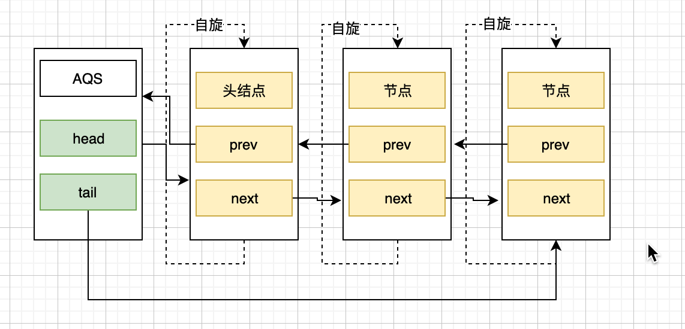
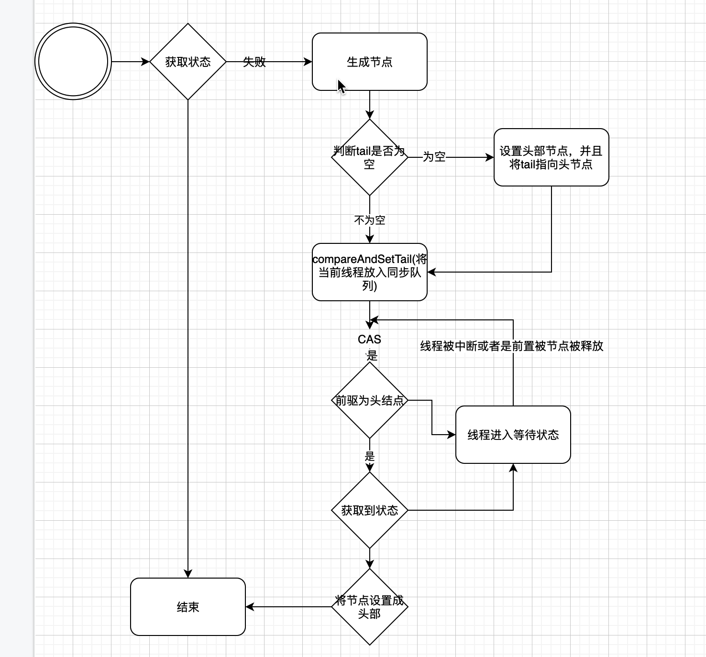
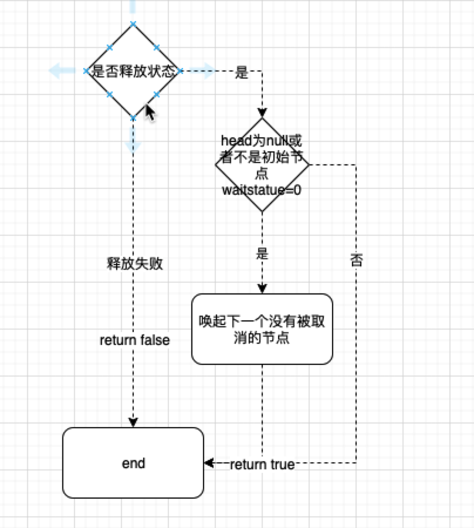
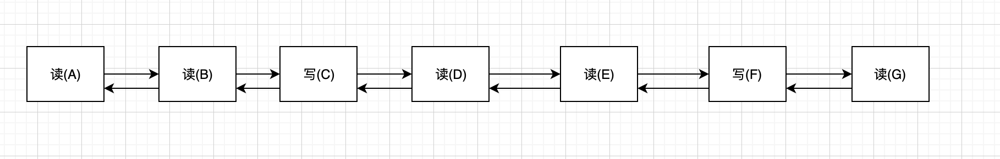

	通过本篇文章，你可以了解到：
		1 java中的锁实际是基于AQS来进行实现的。
		2 AQS内部的数据结构
		3 独占式同步状态的获取与释放
		4 共享式同步状态的获取与释放

#### 一些概念
- 如果对于CAS,自旋锁不了解，麻烦去上一篇《java自旋锁》.

#### 简单理解
队列同步器本质上是在多线程获取锁的时候，如果获取锁失败，那么就将线程以节点的方式放进AQS内部的FIFO(双向队列)队列中，并且轮询前驱节点是否是head，如果是head则表示该节点获取到了锁。反之则表示获取到了锁。释放：当前节点释放了之后，将本节点从队列中移除。将下一节点的prev指向head.

#### 从一个独占式锁示例代码开始
下面这段代码是实现了一个独占式锁。并创建了了一个类有读和写功能
  ```java
  package concurrent.lock;

  import java.util.concurrent.TimeUnit;
  import java.util.concurrent.locks.AbstractQueuedSynchronizer;
  import java.util.concurrent.locks.Condition;
  import java.util.concurrent.locks.Lock;

  /**
   * Created by louxiu
   */

  public class Mutex implements Lock {

      private static class Sync extends AbstractQueuedSynchronizer {

          @Override
          protected boolean isHeldExclusively() {
              return getState() == 1;
          }

          public boolean tryAcquire(int acquire) {
              if (compareAndSetState(0, 1)) {
                  setExclusiveOwnerThread(Thread.currentThread());
                  return true;
              }
              return false;
          }

          public boolean tryRelease(int release) {
              if (getState() == 0) throw new IllegalMonitorStateException();
              setExclusiveOwnerThread(null);
              setState(0);
              return true;
          }

          Condition newCondition() {
              return new ConditionObject();
          }
      }

      private final Sync sync = new Sync();

      @Override
      public void lock() {
          sync.acquire(1);
      }

      @Override
      public void lockInterruptibly() throws InterruptedException {
          sync.acquireInterruptibly(1);
      }

      @Override
      public boolean tryLock() {
          return sync.tryAcquire(1);
      }

      @Override
      public boolean tryLock(long time, TimeUnit unit) throws InterruptedException {
          return sync.tryAcquireNanos(1, unit.toNanos(time));
      }

      @Override
      public void unlock() {
          sync.release(1);
      }

      @Override
      public Condition newCondition() {
          return sync.newCondition();
      }


      public static void main(String[] args) throws InstantiationException, IllegalAccessException, InterruptedException {

          Mutex mutex = new Mutex();


  //        Thread x = ObjectLock.class.newInstance();
  //        x.start();

          Thread t1 = mutex.new FuncLock2(false, mutex);
          Thread t2 = mutex.new FuncLock2(true, mutex);
          Thread t3 = mutex.new FuncLock2(true, mutex);


          t1.start();
          t2.start();
          t3.start();
          t1.join();
          t2.join();
          t3.join();


      }

      public class FuncLock2 extends Thread {

          private Mutex mutex;

          private boolean boo;

          public FuncLock2(boolean b, Mutex mutex) {
              this.boo = b;
              this.mutex = mutex;
          }

          @Override
          public synchronized void run() {
              if (this.boo) {
                  this.read();
              } else {
                  this.write();
              }

          }

          private void read() {
              mutex.lock();
              try {
                  System.out.println(Thread.currentThread().getName() + " read lock ing...");
                  for (int i = 0; i < 5; i++) {
                      System.out.println(mutex.sync.getQueuedThreads());
                      Thread.sleep(1000);
                  }
              } catch (Exception e) {

              } finally {
                  System.out.println(Thread.currentThread().getName() + " read lock end...");

                  mutex.unlock();
              }

          }

          private void write() {
              mutex.lock();

              try {
                  System.out.println(Thread.currentThread().getName() + " write lock ing..");
                  for (int i = 0; i < 5; i++) {
                     
	                     	System.out.println(mutex.sync.getQueuedThreads()); //打印当前队列中的数据
                      Thread.sleep(1000);
                  }

              } catch (Exception e) {

              } finally {
                  System.out.println(Thread.currentThread().getName() + " write end ing..");

                  mutex.unlock();
              }
          }
      }


  }


  ```
- 运行结果
	```
  Thread-0 write lock ing..
  [Thread[Thread-1,5,main]]
  [Thread[Thread-2,5,main], Thread[Thread-1,5,main]]
  [Thread[Thread-2,5,main], Thread[Thread-1,5,main]]
  [Thread[Thread-2,5,main], Thread[Thread-1,5,main]]
  [Thread[Thread-2,5,main], Thread[Thread-1,5,main]]
  Thread-0 write end ing..
  Thread-1 read lock ing...
  [Thread[Thread-2,5,main]]
  [Thread[Thread-2,5,main]]
  [Thread[Thread-2,5,main]]
  [Thread[Thread-2,5,main]]
  [Thread[Thread-2,5,main]]
  Thread-1 read lock end...
  Thread-2 read lock ing...
  []
  []
  []
  []
  []
  Thread-2 read lock end...

  Process finished with exit code 0

	```
	上面这段代码，使用自建的独占式锁，根据不同的场景进行读写操作（同时只允许读和写，上面的结果也是证明了同时启动多个线程，同时只有一个线程在运行）。 查看Mutex的具体实现其实就是依赖于Mutex中的sync(队列同步器，继承AQS)。这就引出了本篇文章要详细剖析的AQS.
	
#### 什么是AQS
- AQS(AbstractQueueSynchronizer) 队列同步器，是构建锁或其他同步组件的基础框架，使用一个int成员变量表示同步状态，通过内置的FIFO队列来完成线程获取资源的排队工作。
- 主要的接口(主要作用是保证状态的改变是安全的) 
	- 整形变量 
	```
		// volatile修饰. 
		private volatile int state; 
	```
	-同步队列  != 等待队列（Condition实现）
	
	- getState() 获取状态 （AQS实现）
		```
		
    protected final int getState() { 
        return state;
    }
		```
	- setState(int newStatus) 设置状态 （AQS实现）
		```
			// 注意：虽然volatile在某一定情况下不是线程安全的(++i/i++)，但是下面的操作是线程安全的
			protected final void setState(int newState) {
        state = newState;
    }
		```
	- compareAndSetState(int expect, int update) CAS操作设置状态 （AQS实现）
		```
			    protected final boolean compareAndSetState(int expect, int update) {
        // See below for intrinsics setup to support this
        return unsafe.compareAndSwapInt(this, stateOffset, expect, update);
    }
		```
#### AQS内部的数据结构
当前线程获取同步状态失败时，同步器会将当前线程以及等待状态等信息构造成一个节点(Node),并将节点加入到队列中，同时会阻塞当前线程。当同步状态被释放时，会将首节点中的线程唤醒，使其再次尝试获取同步状态。所以同步器在实现中涉及到一个节点信息为Node的双向FIFO队列。
- Node
	```java
		static final class Node {
				// 标记节点信息是共享同步状态节点，还是独享状态节点
        static final Node SHARED = new Node();
        // 标记节点信息是共享同步状态节点，还是独享状态节点
        static final Node EXCLUSIVE = null;

        /** 等待状态： 由于同步队列中等待的线程等待超时或者被中断，需要从同步队列中取消等待，节点进入该状态将不会变化 */
        static final int CANCELLED =  1;
        /** 等待状态：后续节点的线程处于等待状态。如果当前线程释放了同步状态或者被取消，将会通知后续节点线程运行 */
        static final int SIGNAL    = -1;
        /** 节点在等待队列中，等待某一个condition触发。当其他线程调用了condition的signal方法后，该节点将会从等待队列移动到同步队列中，加入到对同步状态的获取中 */
        static final int CONDITION = -2;
        /**
         * 标识下一次共享式同步状态获取将会无条件被传播下去
         * unconditionally propagate
         */
        static final int PROPAGATE = -3;

        /**
					等待状态，只有CANCELLED.SIGNAL.CONDITION.PROPAGATE.INITIAL（初始为0）
         */
        volatile int waitStatus;

        /**
				 * 前驱节点（检查其等待状态），入队前指定并且出队前置为null(gc).
         */
        volatile Node prev;

        /**
         * 后继节点 默认Null 
         */
        volatile Node next;

        /**
					* 入队前的线程，并且出队后为null
         */
        volatile Thread thread;

        /**
         * 链接到等待队列中的节点，或者是节点类型(独占或者共享)。意思就是节点类型和等待队列中的后继节点共用一个字段。
         * 
         * 因为只有独占同步状态模式的时候才有条件队列？？？
         */
        Node nextWaiter;

        /**
         * Returns true if node is waiting in shared mode.
         */
        final boolean isShared() {
            return nextWaiter == SHARED;
        }

        /** 获取前驱节点
         */
        final Node predecessor() throws NullPointerException {
            Node p = prev;
            if (p == null)
                throw new NullPointerException();
            else
                return p;
        }

        Node() {    // Used to establish initial head or SHARED marker
        }

        Node(Thread thread, Node mode) {     // Used by addWaiter  共享模式？
            this.nextWaiter = mode;
            this.thread = thread;
        }

        Node(Thread thread, int waitStatus) { // Used by Condition  // 独占模式？
            this.waitStatus = waitStatus;
            this.thread = thread;
        }
    }
	```
	
	#### 独占式同步状态的获取与释放
	- 获取。
		- 多个节点等待获取状态时的队列
			
		- 自旋的逻辑见下图
			
			
		- 通过acquire()获取同步状态
		```
			public final void acquire(int arg) {
        if (!tryAcquire(arg) &&
            acquireQueued(addWaiter(Node.EXCLUSIVE), arg))
            selfInterrupt();
    }
    ```
    tryAcquire先尝试获取状态，如果没有获取到状态则调用acquireQueued将当前线程放入同步队列中。
    其中tryAcquire是一个线程安全的获取获取同步状态的函数。
    Node.EXCLUSIVE表示是独占式模式
		addWaiter是构建节点信息。
		
		```
		/**
		* 生成节点信息，并放入同步队列
		*/
		private Node addWaiter(Node mode) {
        Node node = new Node(Thread.currentThread(), mode);
        // Try the fast path of enq; backup to full enq on failure
        Node pred = tail;
        if (pred != null) {
            node.prev = pred;
            if (compareAndSetTail(pred, node)) {
                pred.next = node;
                return node;
            }
        }
        enq(node);
        return node;
    }
    
    /**
    * 将节点插入到队列中，如果没有头部，那么久就行初始化，设置一个空的Node
    **/
    private Node enq(final Node node) {
        for (;;) {
            Node t = tail;
            if (t == null) { // Must initialize
                if (compareAndSetHead(new Node()))
                    tail = head;
            } else {
                node.prev = t;
                if (compareAndSetTail(t, node)) {
                    t.next = node;
                    return t;
                }
            }
        }
    }
		```
	- 释放
		- release()函数 	
		```
		public final boolean release(int arg) {
        if (tryRelease(arg)) {
            Node h = head;
            // 更新头部节点的状态，以及释放头部节点，并唤醒下一个节点
            if (h != null && h.waitStatus != 0)
                unparkSuccessor(h);
            return true;
        }
        return false;
        }
    ```
	  
	  
		
#### 共享式同步状态获取与释放
- 共享同步状态的获取与独占式同步状态的获取稍微有点不一样。**独占式释放锁之后才能触发后继节点获取锁**。 共享式同步状态可以被多个线程获取**所以共享式同步状态在获取和释放的时候，都会唤醒后继节点**。简单理解就是当某个线程可以获取到锁的时候，对于独占式就只能该线程释放后其他线程才能获取。共享式在某个线程获取的时候，其他线程有可能也可以获取到锁。
- 如下图(读写锁只是举例)
	- 独占式
		- 当读(A)获取到锁的时候，读(B)只能等待读(A)释放后才可以
	- 共享式
		- 当读(A)获取到锁的时候，读(B)可以同时获取到锁
		- 当读取到写(C) 则只能写(C) 单独占据
		- 当读(D)获取到锁的时候，读(E)可以同时获取到锁
- 
- 

- 源码
	
	```
	// 获取
	public final void acquireShared(int arg) {
				// tryAcquireShared(arg) <0 的时候表示没有获取到同步状态，调用doAcquireShared进行CAS获取状态。
				// val = tryAcquireShared(arg) >= 0 则表示获取到的同步状态
				// val 大于0 表示当前线程获取共享锁成功，并且接下来其他线程尝试获取共享锁的行为可以成功(可能)
				// val 等于0.表示当前线程获取共享锁成功，但是接下来其他线程尝试获取共享锁会失败
	    if (tryAcquireShared(arg) < 0)
	        doAcquireShared(arg);
	}
	 		// 如果当前节点的前驱节点是头部节点，并且tryAcquireShared(arg) >= 0，则表示获取到了同步状态，就进行推出
	 		private void doAcquireShared(int arg) {
        final Node node = addWaiter(Node.SHARED);
        boolean failed = true;
        try {
            boolean interrupted = false;
            for (;;) {
                final Node p = node.predecessor();
                if (p == head) {
                    int r = tryAcquireShared(arg);
                    if (r >= 0) {
                        setHeadAndPropagate(node, r);
                        p.next = null; // help GC
                        if (interrupted)
                            selfInterrupt();
                        failed = false;
                        return;
                    }
                }
                if (shouldParkAfterFailedAcquire(p, node) &&
                    parkAndCheckInterrupt())
                    interrupted = true;
            }
        } finally {
            if (failed)
                cancelAcquire(node);
        }
    }
  ```
  
	

  ```
  
  ```