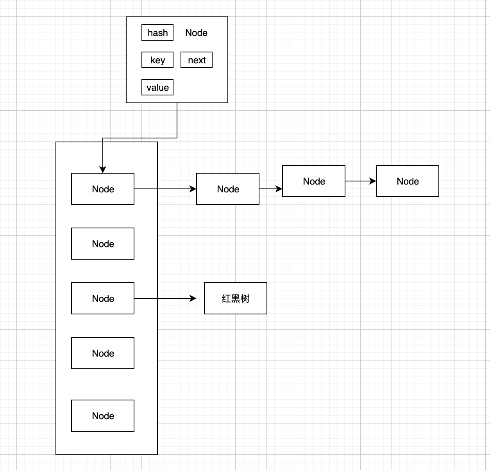

<!-- more -->

#### HashMap
我们从下面几个角度来剖析下jdk1.8的HashMap
- HashMap 的存储结构
- HashMap的构造器
- HashMap的put方法
- HashMap的get方法

##### HashMap 的存储结构
- 如果冲突数是小于阈值(默认是8) 则是数组+链表
- 如果冲突数是大于阈值(默认是8) 则是数组+红黑树
- 具体见下图
	****

#### HashMap的构造器
```
		// 初始化size. 并且制定需要resize的阈值
		public HashMap(int initialCapacity, float loadFactor) {
        if (initialCapacity < 0)
            throw new IllegalArgumentException("Illegal initial capacity: " +
                                               initialCapacity);
        if (initialCapacity > MAXIMUM_CAPACITY)
            initialCapacity = MAXIMUM_CAPACITY;
        if (loadFactor <= 0 || Float.isNaN(loadFactor))
            throw new IllegalArgumentException("Illegal load factor: " +
                                               loadFactor);
        this.loadFactor = loadFactor;
        this.threshold = tableSizeFor(initialCapacity);
    }

   	// 制定数组的长度(注意这里实际是threshold. threshold是最小的2^n并且大于等于initialCapacity )
    public HashMap(int initialCapacity) {
        this(initialCapacity, DEFAULT_LOAD_FACTOR);
    }

   // resize 的阈值
    public HashMap() {
        this.loadFactor = DEFAULT_LOAD_FACTOR; // all other fields defaulted
    }

    // 其他的Map
    public HashMap(Map<? extends K, ? extends V> m) {
        this.loadFactor = DEFAULT_LOAD_FACTOR;
        putMapEntries(m, false);
    }
```
##### HashMap的put方法
- 需要注意的是jdk1.8中引入了红黑树，本篇对红黑树不多讲，如果需要知道详细的请自行google
```
		// 对外
		public V put(K key, V value) {
        return putVal(hash(key), key, value, false, true);
    }
   // 这个方法是优化
   // 1 h>>> 16 表示高位也参与了计算，减小碰撞率
   // 2	(n-1)&hash == hash%n  &比%计算的快
   static final int hash(Object key) {
        int h;
        return (key == null) ? 0 : (h = key.hashCode()) ^ (h >>> 16);
    }

   	// 插入新节点，replace 原有的value,resize, 链表转红黑树
    final V putVal(int hash, K key, V value, boolean onlyIfAbsent,
                   boolean evict) {
        Node<K,V>[] tab; Node<K,V> p; int n, i;
        // 如果table 为null, 或者是tab的长度为0，就需要进行扩容
        if ((tab = table) == null || (n = tab.length) == 0)
            n = (tab = resize()).length;  // 扩容 resize
        // 如果对应的节点值为Null  则表示没有碰撞，直接创建一个新的node
        if ((p = tab[i = (n - 1) & hash]) == null)
            tab[i] = newNode(hash, key, value, null);
        else {
        	// 表示有碰撞了
            Node<K,V> e; K k;
            // 这个表示 key是一样的
            if (p.hash == hash &&
                ((k = p.key) == key || (key != null && key.equals(k))))
                e = p;
           // 如果key 不一样 并且是TreeNode 就需要红黑树插入
            else if (p instanceof TreeNode)
                e = ((TreeNode<K,V>)p).putTreeVal(this, tab, hash, key, value);
            else {
            // key不一样，并且不是树节点，就表示是链表了。需要将节点追加到链表的尾部(如果超过阈值(默认8)，就需要转成红黑树)
                for (int binCount = 0; ; ++binCount) {
                		// 如果同样key 的Node 没有下一个Node. 则直接追加一个新的Node
                    if ((e = p.next) == null) {
                        p.next = newNode(hash, key, value, null);
                        // 是否超过红黑树的阈值
                        if (binCount >= TREEIFY_THRESHOLD - 1) // -1 for 1st
                            treeifyBin(tab, hash);
                        break;
                    }
                    // 这里表示下一个节点的key与要插入的key是一样的
                    if (e.hash == hash &&
                        ((k = e.key) == key || (key != null && key.equals(k))))
                        break;
                    // 继续下一个Node
                    p = e;
                }
            }
            // e不为null 则表示有同样key的Node存在
            if (e != null) { // existing mapping for key
                V oldValue = e.value;
                // onlyIfAbsent->为false 或者原来的value为null. 则表示需要替换掉原来的值
                if (!onlyIfAbsent || oldValue == null)
                    e.value = value;
                // 额外的接口，访问完之后回调
                afterNodeAccess(e);
                return oldValue;
            }
        }
        // 到这里 就表示没有key一样，并且已经Put了
        ++modCount;
        // 更新size
        if (++size > threshold)
            resize();
        // 插入成功之后回调
        afterNodeInsertion(evict);
        return null;
    }

    // 扩容
    final Node<K,V>[] resize() {
        Node<K,V>[] oldTab = table;
        int oldCap = (oldTab == null) ? 0 : oldTab.length;
        int oldThr = threshold;
        int newCap, newThr = 0;
        // 如果原有table不为空
        if (oldCap > 0) {
        		// 原有table 大于最大的数组，不用扩容了
            if (oldCap >= MAXIMUM_CAPACITY) {
                threshold = Integer.MAX_VALUE;
                return oldTab;
            }
            // 这里就是扩容一倍， 设置新的上限
            else if ((newCap = oldCap << 1) < MAXIMUM_CAPACITY &&
                     oldCap >= DEFAULT_INITIAL_CAPACITY)
                newThr = oldThr << 1; // double threshold
        }
        // 原有为空，则查看阈值是否大于0
        else if (oldThr > 0) // initial capacity was placed in threshold
            newCap = oldThr;  // 默认值，或者是指定的值
        else {               // 到这里 其实就是 原来数组没有值，并且threshold也小于等于0，就直接给默认值
            newCap = DEFAULT_INITIAL_CAPACITY;
            newThr = (int)(DEFAULT_LOAD_FACTOR * DEFAULT_INITIAL_CAPACITY); 
        }
        // newThr(前面初始化为0) 为0,则需要重新计算下上限
        if (newThr == 0) {
            float ft = (float)newCap * loadFactor;
            newThr = (newCap < MAXIMUM_CAPACITY && ft < (float)MAXIMUM_CAPACITY ?
                      (int)ft : Integer.MAX_VALUE);
        }
        threshold = newThr;
        // 截止到这里，扩容已经完成了，下面就是讲原来的数据全部重新计算下hash
        @SuppressWarnings({"rawtypes","unchecked"})
        Node<K,V>[] newTab = (Node<K,V>[])new Node[newCap];
        table = newTab;
        if (oldTab != null) {
            for (int j = 0; j < oldCap; ++j) {
                Node<K,V> e;
                // 
                if ((e = oldTab[j]) != null) {
                    oldTab[j] = null;
                    // 如果没有下一个节点，直接赋值
                    if (e.next == null)
                        newTab[e.hash & (newCap - 1)] = e;
                    // 如果下一个节点是红黑树，进行红黑树的操作
                    else if (e instanceof TreeNode)
                        ((TreeNode<K,V>)e).split(this, newTab, j, oldCap);
                   // 链表
                   // 下面操作的逻辑是，因为是扩容了2倍，所以将原来链表上的数据根据新的hash值，拆分成高位的(j+oldCap)&低位的(j) 两个链表
                    else { // preserve order
                        Node<K,V> loHead = null, loTail = null;
                        Node<K,V> hiHead = null, hiTail = null;
                        Node<K,V> next;
                        do {
                            next = e.next;
                            if ((e.hash & oldCap) == 0) {
                                if (loTail == null)
                                    loHead = e;
                                else
                                    loTail.next = e;
                                loTail = e;
                            }
                            else {
                                if (hiTail == null)
                                    hiHead = e;
                                else
                                    hiTail.next = e;
                                hiTail = e;
                            }
                        } while ((e = next) != null);
                        if (loTail != null) {
                            loTail.next = null;
                            newTab[j] = loHead;
                        }
                        if (hiTail != null) {
                            hiTail.next = null;
                            newTab[j + oldCap] = hiHead;
                        }
                    }
                }
            }
        }
        // 返回扩容后的先的tab
        return newTab;
    }
```
#### HashMap的get方法
```
public V get(Object key) {
        Node<K,V> e;
        return (e = getNode(hash(key), key)) == null ? null : e.value;
    }

final Node<K,V> getNode(int hash, Object key) {
        Node<K,V>[] tab; Node<K,V> first, e; int n; K k;
        // 如果tab 不为空，且length不大于等于0 且命中hash
        if ((tab = table) != null && (n = tab.length) > 0 &&
            (first = tab[(n - 1) & hash]) != null) {
            if (first.hash == hash && // 如果第一个节点的key与key是一样的，直接返回
                ((k = first.key) == key || (key != null && key.equals(k))))
                return first;
            // 如果第一个没有命中，且有子节点
            if ((e = first.next) != null) {
            		// 如果是红黑树
                if (first instanceof TreeNode)
                    return ((TreeNode<K,V>)first).getTreeNode(hash, key);
                // 链表
                do {
                    if (e.hash == hash &&
                        ((k = e.key) == key || (key != null && key.equals(k))))
                        return e;
                } while ((e = e.next) != null);
            }
        }
        // 没有命中
        return null;
    }
```

##### HashMap 线程不安全问题
- jdk1.7 是存在多线程操作resize 死循环(这里简单提一下死循环的原因: resize的是时候链表会倒序。多个线程就会导致A->B->A.)
- jdk1.8虽然已经修复了死循环问题,但是没有加任何额外的同步操作，还是存在线程不安全。
	- 存在数据丢失。
		- 多线程时，如果线程A resize 了, hash结果为AHash， 线程B持有原有的threshold, 并且计算出来的hash也是AHash, 则直接覆盖掉对应的链表头。就会导致数据丢失。

#### 线程安全的Map
- 前面聊到HashMap 不是线程安全的，在java中线程安全的Map有下面几个
	- Hashtable & SynchronizedMap
		 - 方法使用synchronized 修饰。 效率偏低
	- ConcurrentHashMap 
		- 采用分段锁的概念，效率比Hashtable 高很多 

#### ConcurrentHashMap


#### 参考大佬
[JDK1.8 HashMap源码分析](https://www.cnblogs.com/xiaoxi/p/7233201.html)