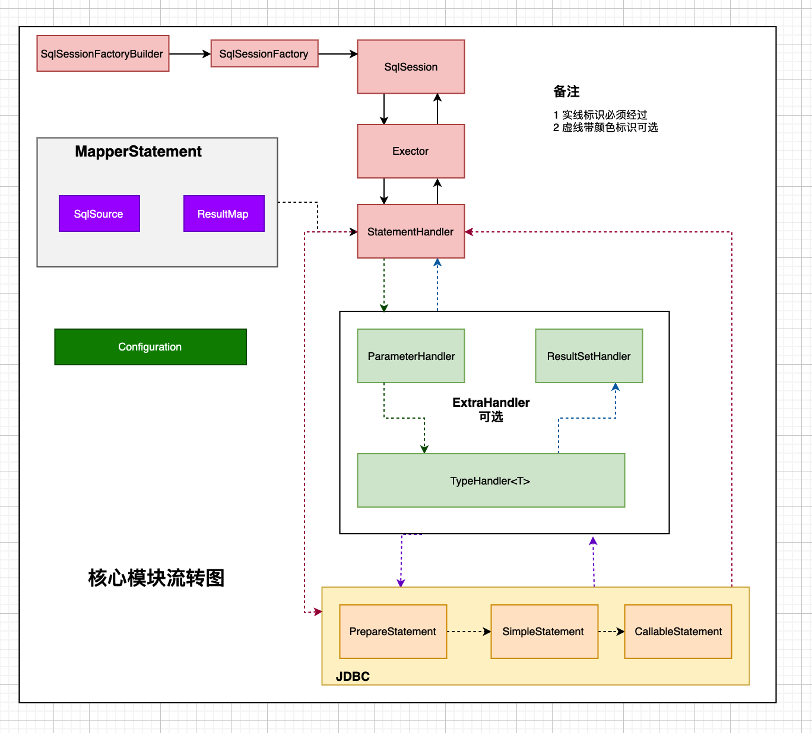
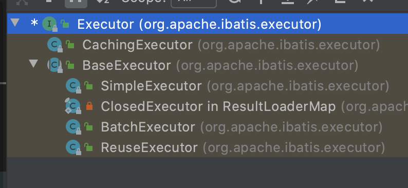

---
<<<<<<< HEAD
title: 聊聊Mybatis[整体概览]
tags: [java,mybatis,mysql]
---

<!-- more -->

#### 核心模块(类)
核心模块流转关系见下图





##### SqlSessionFactoryBuilder
描述:每一个MyBatis的应用程序的入口是SqlSessionFactoryBuilder。通过读取配置文件
作用: 生成SqlSessionFactory

=======
title: 聊聊Mybatis[整体架构]
tags: [java,mybatis,mysql]
---


#### 核心子模块

##### SqlSessionFactoryBuilder
* 功能: 如题
* 描述: 每个Mybatis的程序的入口都是SqlSessionFactoryBuilder. 读取相关的配置，并且创建SqlSessionFactory.

##### SqlSessionFactory
* 功能: 如题，SqlSession工厂方法
* 描述:  就是创建SqlSession. 同SqlSessionFactoryBuilder一样，在同一个服务中维持单例模式即可。
* 部分接口
	```java
	public interface SqlSessionFactory {

  SqlSession openSession();

  SqlSession openSession(boolean autoCommit);
  SqlSession openSession(Connection connection);
  SqlSession openSession(TransactionIsolationLevel level);

  SqlSession openSession(ExecutorType execType);
  SqlSession openSession(ExecutorType execType, boolean autoCommit);
  SqlSession openSession(ExecutorType execType, TransactionIsolationLevel level);
  SqlSession openSession(ExecutorType execType, Connection connection);

  Configuration getConfiguration();
	}
	```
	
##### SqlSession
* 功能: 对数据库进行一次访问，包括SQL的动态拼装，以及结果的映射。
* 描述: 线程不安全，所以每次都是由SqlSessionFactory创建一个新的SqlSession实例。
* 注意点:
	* 两个核心属性: Configuration(配置)以及Executor(执行器)
	* 默认是`DefaultSqlSession` 并开启一级缓存，创建Executor 以及赋值

##### Executor
* 功能: 调用StatementHandler 访问数据库。如果开启缓存，会将结果存入缓存中
* 描述: 实际运行的单位。在创建SqlSession的时候，随之创建。
* 类图:
		
	

##### StatementHandler
* 功能: 真正访问数据库的地方，调用其他三种handler(ParameterHandler,ResultSetHandler,TypeHandler)

##### ParameterHandler
* 功能: 解析sql中的参数

##### TypeHandler
* 功能: 负责将参数，或者是结果类型转换。

##### ResultSetHandler
* 功能: 负责将访问数据库的结果做映射

##### MappedStatement
* 功能: 管理SqlSoure 参数等

##### SqlSource
* 功能: 根据用户传递的ParameterObject，动态生成SQL，将信息封装到BoundSql中

##### BoundSql
* 功能: 提供实际的SQL以及对应的参数信息

##### Configuration
* 功能: 保存所有的配置信息
>>>>>>> b1e8561b24729a2911f08ba444398c47a530d867
