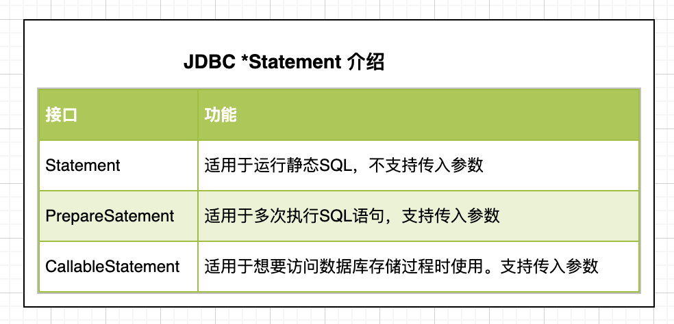
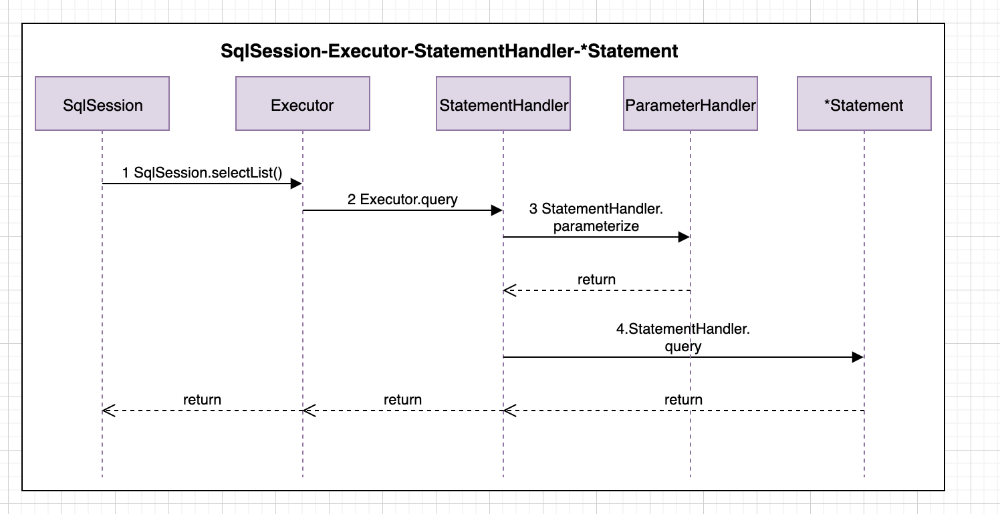
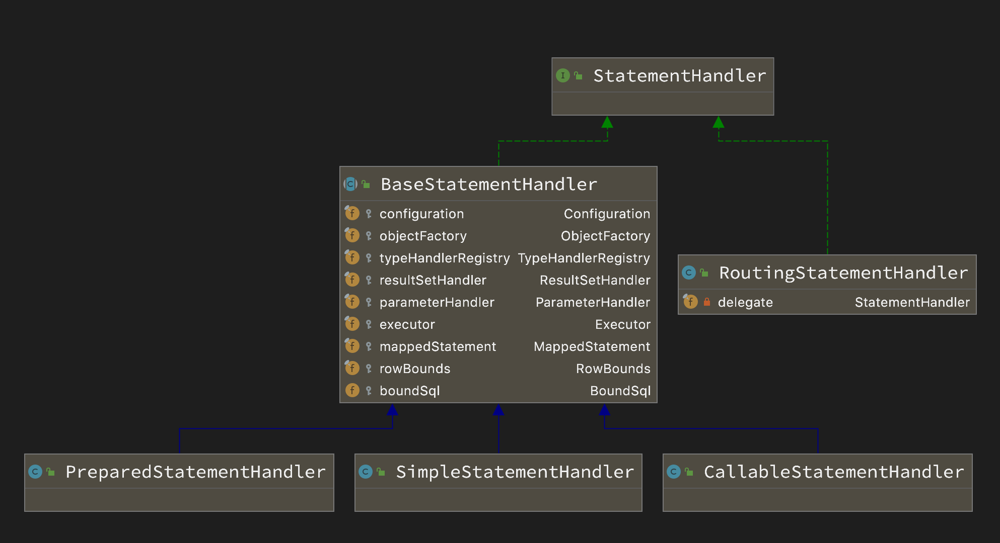

我们前面将SqlSession将SQL执行委托给Executor,Executor又最终委托给了StatementHandler. 本篇我们来剖析下StatementHandler是如何做到实质性的SQL执行。

<!-- more -->

#### 一些概念
##### JDBC 中的Statement/PrepareStatement/CallableStatement接口是啥
简单讲：`*Statement`是在我们获取到数据库连接conn之后，可以让我们发送SQL命令或者PL/SQL(过程化SQL)命令到数据库，并可以从数据库获取到数据。
**就是一个中介，我们只需要通过`*Statement`执行SQL,获取结果，其他的我们就可以不用关心了。**
* 三种Statement接口功能表



#### 一次Query的时序图
我们通过一次Query的时序图来大致看下SqlSession,Executor,StatementHandler, `*Statement`，Transaction之间的关系.



观看上图，其实StatementHandler也不是最终的执行者，而是委托给了`*Statement`.但是由于`*Statement`是JDBC的东西(Mybatis本身就是针对jdbc-connector的二次封装)，所以对于Mybatis来讲，StatementHandler就是SQL执行前的最后一棒。

#### StatementHandler 部分源码分析

##### 先来一个类关系图


* BaseStatementHandler 抽象基类。类似BaseExecutor. 提供通用方法支持，需要定制化，使用模板模式由子类实现.
* SimpleStatementHandler 继承BaseStatementHandler. 操作JDBC.Statement接口。
* PreparedStatementHandler 继承BaseStatementHandler. 操作JDBC.PreParedStatement接口。
* CallableStatementHandler 继承BaseStatementHandler. 操作JDBC.CallableStatement接口。
* RoutingStatementHandler 策略类，根据MappedStatement类型创建上面三种StatementHandler.

