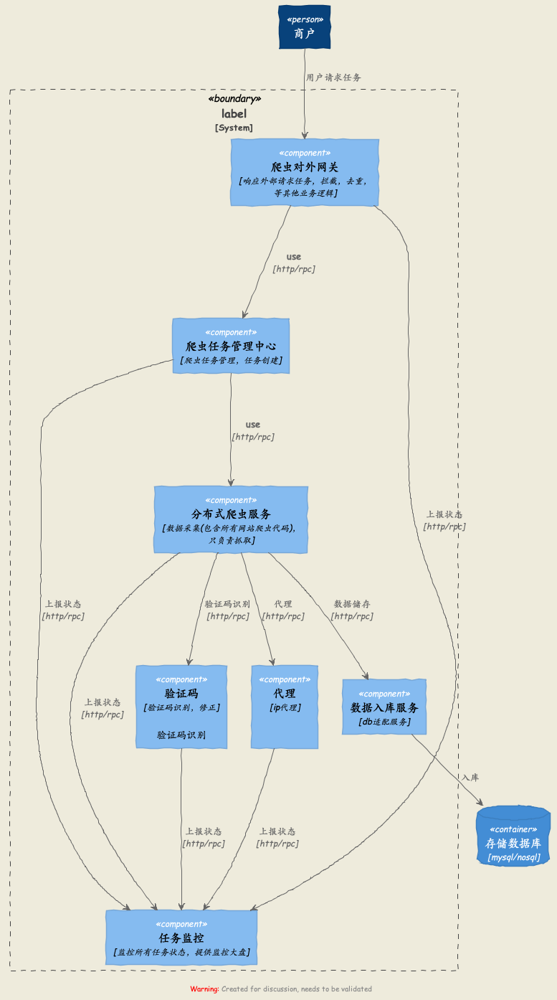

- 各种概念
- 设计理念
- 架构图
- 各模块介绍以及相关的技术选型

大写的PS
----
- 凡是不结合业务直接套框架，必有后悔的一天。
- 本文只讲互联网数据采集
- 本文只是本人总结，如有问题，欢迎指出

各种概念
----
- 什么是数据采集
	- 通俗来讲，就是把想要的数据，从不同的源头获取，解析想要的数据到指定的位置。例如：互联网，手动录入等源。
- 什么是网络爬虫
	- 通俗来讲，传统方式收集数据的话，需要按照一定的步骤（登录网站，找到目标数据，然后再进行copy-paste），必定劳力费心。爬虫就是把这个东西，交给程序去搞。（节省人力，所谓发展的需要？） 

通用架构图
----

分为下面几个模块
- 爬虫对外网关
- 爬虫任务管理中心
- 分布式爬虫服务
- 验证码服务
- 代理服务
- 入库服务
- 数据库
- 监控中心

各模块讲解

- 