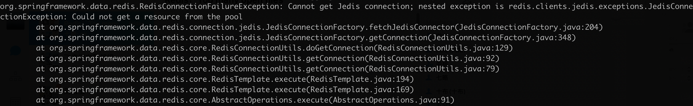
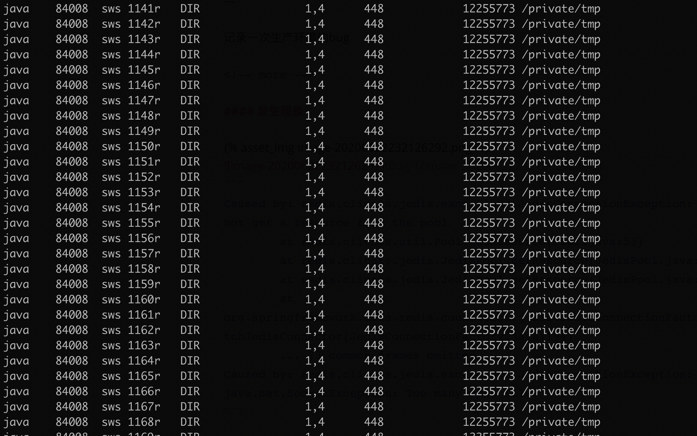

记录一次生产环境的bug

<!-- more -->

#### 发生现象



```
Caused by: redis.clients.jedis.exceptions.JedisConnectionException: Could not get a resource from the pool
        at redis.clients.util.Pool.getResource(Pool.java:53)
        at redis.clients.jedis.JedisPool.getResource(JedisPool.java:226)
        at redis.clients.jedis.JedisPool.getResource(JedisPool.java:16)
        at org.springframework.data.redis.connection.jedis.JedisConnectionFactory.fetchJedisConnector(JedisConnectionFactory.java:194)
        ... 23 common frames omitted
Caused by: redis.clients.jedis.exceptions.JedisConnectionException: java.net.SocketException: Too many open files
```

#### 开始追踪&&定位问题
根据`Redis Too many open files ` 关键字 搜索到[这篇文章](https://www.pianshen.com/article/7592263263/)

然后就发现对应的java进程使用`lsof -p pid` 有很多文件夹目录的句柄并没有被释放，如下图



#### 定位代码
在上面的定位到问题之后，开始找项目的代码里面有哪些代码使用到了这些目录，最后就发现类似如下的代码
```
            DirectoryStream<Path> paths = Files.newDirectoryStream(Paths.get(path));
            ...
            并没有手动close.
```
##### 看下源码
```
    public static DirectoryStream<Path> newDirectoryStream(Path dir,
                                                           DirectoryStream.Filter<? super Path> filter)
        throws IOException
    {
        return provider(dir).newDirectoryStream(dir, filter);
    }
```
特别地，注意下面的注释
```
 * <p> When not using the try-with-resources construct, then directory
     * stream's {@code close} method should be invoked after iteration is
     * completed so as to free any resources held for the open directory.
     *
```
当没有使用**try-with-resources** 结构的时候，使用stream的地方必须手动invoke(手动close)，用来释放资源.

#### 解决
既然是需要手动close,手动close即可。

#### 手动复现代码
```
    @Test
    public void testIO() throws IOException, InterruptedException {

        for (int i = 0; i < 1000; i++) {
            DirectoryStream<Path> paths = Files.newDirectoryStream(Paths.get("/tmp"));
//            paths.close();  //如果不显示调用close,使用lsof -p pid 就可以看到很多目录占用了句柄，并没有被释放
        }

        Thread.sleep(300000);

    }
```

#### 总结
大致翻了了java.nio.file.Files的里面的函数`newDirectoryStream` 都是需要手动close, 另外还有个函数也是需要手动close的 `Files.lines`。
所以使用工具函数是可以的，但是也要知其内部实现原理，否则搞不好就是一个定时炸弹