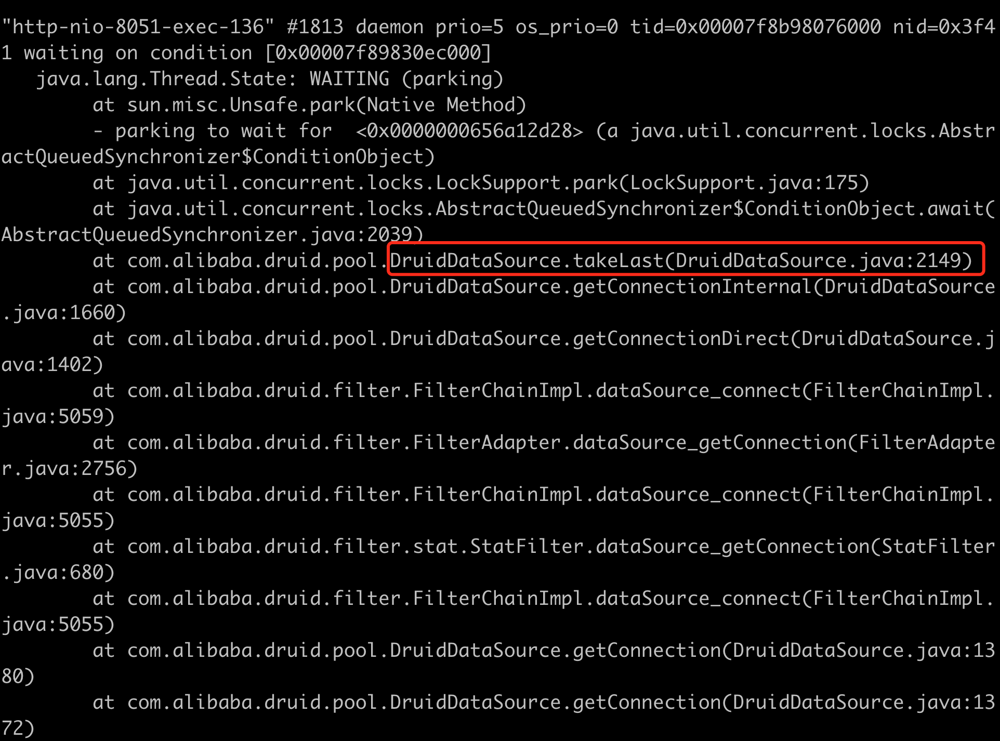

本文分享下最近一个很有意思的线上问题。

<!-- more -->


#### 问题现象:

1. 业务上游发现所有的请求都超时

#### 问题定位

1. 业务上游发现所有的请求都超时

2. 去线上机器通过手动调用接口`curl http://localhost:8051/rest/status?job_id=1` 命令查询，同样阻塞

3. `jstack -l pid` 将堆栈打印出来。发现http-nio-8051 线程都是阻塞在`com.alibaba.druid.pool.DruidDataSource.takeLast`

   <!--  -->
   

4. 网上查了一下[参考](https://www.cnblogs.com/heyouxin/p/14787291.html)， 是因为连接池被打满并且maxWait=-1，通过查看application.yml，确实是使用的`DruidDataSource`并且没有设置maxWait.  初步定位到是MySQL连接池被打满，阻塞住了。接下来查找为什么阻塞。

5. 结果发现代码存在如下代码:(这里其实直接看堆栈就可以看出来是哪里阻塞住了)

   ```
   
   #####RestTaskDAO.updateTaskStatus
   @Transactional(rollbackFor = Exception.class, propagation = Propagation.REQUIRES_NEW) // // 此处使用了REQUIRES_NEW 即每次都创建一个新的事务(即需要新的一个MySQL连接)
   public void updateTaskStatus(String taskId, String bizType, Integer taskStatus,String  msg) {
   	mapper.updateTaskStatus(taskId, bizType, taskStatus, msg);
   }
   
    ####RestTaskMapper.updateTaskStatus
    @Transactional(rollbackFor = Exception.class, propagation = Propagation.REQUIRES_NEW) // 此处使用了REQUIRES_NEW 即每次都创建一个新的事务(即需要新的一个MySQL连接)
       @Update(value = "update task set task_status = #{taskStatus}, msg = #{msg} where task_id = #{taskId} and biz_type= #{bizType}")
       void updateTaskStatus(@Param("taskId") String taskId,
                             @Param("bizType") String bizType,
                             @Param("taskStatus") Integer taskStatus,
                             @Param("msg") String msg);
   
   ```

   1. 根据上面的事务嵌套，就是一个updateTaskStatus需要进行两次串行的getConnection。
   2. 综上当并发到一定程度的时候(默认是8个)，即同时有8个`RestTaskDAO.updateTaskStatus`先获取到了MySQL的connection. 大家都需要获取到`RestTaskMapper.updateTaskStatus`,但是因为`maxWait=-1` ，8个`RestTaskDAO.updateTaskStatus`不会被释放掉，但是又需要8个``RestTaskMapper.updateTaskStatus`, 就陷入了逻辑上的死锁。现象就是所有都卡死在获取MySQL的connection上。

   

#### 本地复现
- 设置maxActive为1，在`com.alibaba.druid.pool.DruidDataSource#getConnectionInternal`打断点。 调用`RestTaskDAO.updateTaskStatus`。 结果就是发现`com.alibaba.druid.pool.DruidDataSource#getConnectionInternal被调用了两次
   1. 第一次`RestTaskDAO.updateTaskStatus`

     <!--  -->
		
     下面是堆栈信息

       ```
       doBegin:256, DataSourceTransactionManager (org.springframework.jdbc.datasource)
       getTransaction:378, AbstractPlatformTransactionManager (org.springframework.transaction.support)
       createTransactionIfNecessary:474, TransactionAspectSupport (org.springframework.transaction.interceptor)
       invokeWithinTransaction:289, TransactionAspectSupport (org.springframework.transaction.interceptor)
       invoke:98, TransactionInterceptor (org.springframework.transaction.interceptor)
       proceed:186, ReflectiveMethodInvocation (org.springframework.aop.framework)
       intercept:688, CglibAopProxy$DynamicAdvisedInterceptor(org.springframework.aop.framework)
       updateTaskStatus:-1, RestTaskDAO$$EnhancerBySpringCGLIB$$39ce0413 // 注意这里 (com.rest.rest.openapi.repository.dao)
       update:104, RestController (com.rest.rest.openapi.facade.rest)
       invoke:-1, RestController$$FastClassBySpringCGLIB$$a85862fd (com.rest.rest.openapi.facade.rest)
       invoke:218, MethodProxy (org.springframework.cglib.proxy)
       ```

   2. 第二次`RestTaskMapper.updateTaskStatus`,
   
      <!--  -->
      
   
      下面是具体的堆栈信息
     ```
        doBegin:256, DataSourceTransactionManager (org.springframework.jdbc.datasource)
        handleExistingTransaction:430, AbstractPlatformTransactionManager (org.springframework.transaction.support)
        getTransaction:354, AbstractPlatformTransactionManager (org.springframework.transaction.support)
        createTransactionIfNecessary:474, TransactionAspectSupport (org.springframework.transaction.interceptor)
        invokeWithinTransaction:289, TransactionAspectSupport (org.springframework.transaction.interceptor)
        invoke:98, TransactionInterceptor (org.springframework.transaction.interceptor)
        proceed:186, ReflectiveMethodInvocation (org.springframework.aop.framework)
        invoke:49, DynamicDataSourceAnnotationInterceptor(com.baomidou.dynamic.datasource.aop)
        proceed:186, ReflectiveMethodInvocation (org.springframework.aop.framework)
        invoke:212, JdkDynamicAopProxy (org.springframework.aop.framework)
        updateTaskStatus:-1, $Proxy141 (com.sun.proxy) // 这里是Mapper代理类, 这里是第二次调用
        updateTaskStatus:33, RestTaskDAO (com.rest.rest.openapi.repository.dao) // 就是DAO
        invoke:-1, RestTaskDAO$$FastClassBySpringCGLIB$$a73442ff(com.rest.rest.openapi.repository.dao)
        invoke:218, MethodProxy (org.springframework.cglib.proxy)
        invokeJoinpoint:749, CglibAopProxy$CglibMethodInvocation(org.springframework.aop.framework)
        proceed:163, ReflectiveMethodInvocation (org.springframework.aop.framework)
     ```
   
   3. 再次调用updateStatus接口，就直接被阻塞住了。


#### 解决方案:

1. 去除掉`RestTaskMapper.updateTaskStatus`上面的Transaction. 并且将`RestTaskDAO.updateTaskStatus`事务的传播属性改为默认(与主线程使用一个)
2. 设置druid.maxWait具体时间，这里我们结合实际业务是`3000ms`


#### 复盘原因：

1. 本次主要出现问题的原因主要还是在于对Spring的事务不熟悉，导致乱用出错。
