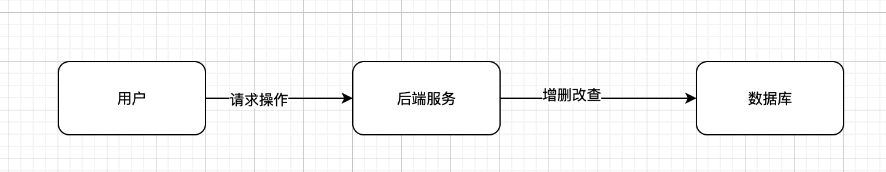

前面我们聊了如何[高并发请求](https://lasbun.github.io/2020/03/23/HCD-1/). 本篇从通俗的角度来梳理下一个稍微高并发的后端会涉及到哪些。

<!-- more -->

#### 脱离业务聊高并发，都是在扯淡
- 下面我就是在扯淡

#### 最基本的一个后端
- 
- 

- 后端最基本的属性请求的数据进行增删改查。
- 如上图所示，demo版服务基本就是基本这个样子.
- 上面的基本不考虑其他的业务逻辑，超过一定的qps，基本上服务端就会出现响应慢，偶尔服务端报错

#### 公司业务上来了
- 大部分操作其实都是进行读操作，所以这个时候可以加缓存。毕竟单机redis轻松几万并发。改造之后的架构如下
- 

#### 业务更上一层楼
- 随着业务的扩展，对数据库的增删改也变得越来越多，单独连一个数据库，扛不住了。
- 怎么办？
	- 拆分系统---->一个系统对应一个数据库。
	- 统一业务数据库，分库分表，减少对单一数据库的请求压力
	- 读写分离 搞个主从
- 

#### 写也跟不上了
- 写的瓶颈实在是瓶颈了。
- 怎么办？
	- 延迟写入. 加个MQ，慢慢写。
	- 

#### 数据统计太慢了
- 上es.（es 对于一些统计性的工作，支持能力很强，而且是分布式，扩容方便）
- 

#### 总结下
- 基本是从下面几个面
	- 数据库分库分表
	- 数据库读写分离
	- 系统拆分(都放在一个系统内，系统之间会相互影响)
	- 数据读取+缓存
	- 查询，统计等可以使用es
	- 并发实在是高，并且业务允许延迟更新，可以加MQ，延迟更新

#### 参考大佬

[如何设计一个高并发系统？](https://doocs.github.io/advanced-java/#/./docs/high-concurrency/high-concurrency-design)