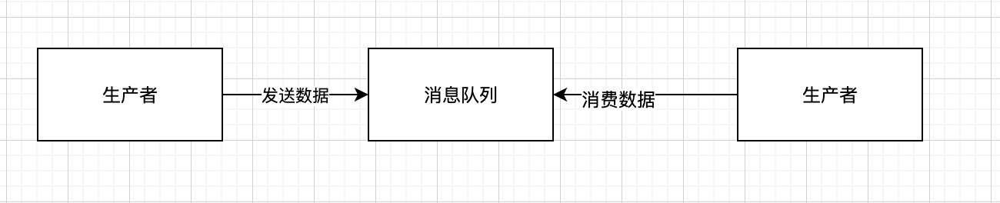

这个问题一定是要结合实际的业务来判断，本篇只是梳理了下一般的排查思路以及相应的解决方案。

<!-- more -->

#### 什么场景才会引起重复消费
- 

- 看上图，一般使用消息队列的场景就是，生成者生产数据到消息队列。消息队列存储数据。消费者从消息队列中获取数据消费。下面我们分别从三个场景来分析那种情况会有重复消费。

##### 生产者重复发送数据
- 在消费和消息队列存储都没有问题的情况下，如果生产者生产的重复的数据，这个样子就会有重复的消息消费
- 这种情况下，大部分都是由于业务代码逻辑问题。需要梳理下业务代码中是否会存在数据重新发送的情况。如果不能判断这种情况，也没有问题，在消费者消费的时候解决即可（即消费幂等）

##### 消息队列重复存储
- 一般不会出现这种，例如RabbitMQ，kafka，一般都是会保证数据存储的唯一性的。

##### 消费者重复消费
- 这种其实也是业务代码负重要责任。所有的MQ基本都会复现这种情况。
- Kafka举例:kafka有offset的概念。每个数据写进去kafka，都会有一个offset。消费者每消费一个消息后，就将自己的offset提交下，表示这个消息我消费过了，下次从这个offset之后的数据开始给我数据。由于我们消费的时候，有可能是代码进程直接挂掉，导致消费了，但是offset没有提交成功，下次获取数据的时候就重新获取到了实际已经消费国的数据了。
- RabbitMQ也有类似kakfa offset的机制，是ack机制。
- 重复消费其实 不可怕，只需要我保持每次消费一样的消息，我的结果都是一样的即可。
	- 举例：我们需要将每次消费的信息都保存到数据库中。如果同样的消息我们消费最终数据库只有一条，那么其实对我们实际业务是没有任何影响的。这就是所谓的**幂等**

#### 关于幂等，业务角度的一点思考
- 如果消费是更新数据库，那么可以先查询是否存在，如果存在就不插入，如果不存在就插入
- 如果是做缓存，就保持唯一的key, 一直更新缓存就好。只要消息内容一样，无论什么时候缓存结果都是一样。
- 如果是其他场景，可以考虑对每个消息都有一个唯一标识，消费了就保存起来。下次再接收到类型的先查询是否消费过唯一标识，那么就可以避免重复消费。
- 还可以考虑如果是一样的数据，对数据进行合并操作（具体业务具体分析）

#### 参考大佬

[如何保证消息不被重复消费？（如何保证消息消费的幂等性）](https://doocs.github.io/advanced-java/#/./docs/high-concurrency/how-to-ensure-that-messages-are-not-repeatedly-consumed)

