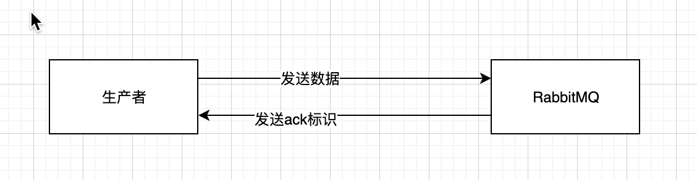
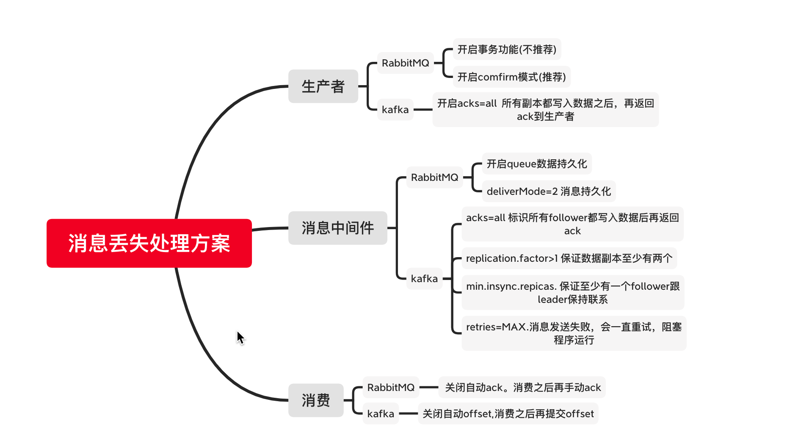

本篇文章梳理了数据丢失的源头，以及关于如何避免的一些思考

<!-- more -->

#### 数据丢失的源头

- 

看上图，还是生产者，消息队列，消费者。

##### 生产者&&相关的解决方案
- 生产者数据丢失场景其实很常见。举例：程序宕机, 网络问题等。
- 不同的MQ有不同的解决措施，下面从RabbitMQ&&Kakfa 两个常见 的消息中间件来解决。

###### RabbitMQ
- RabbitMQ有提供事务功能以及confirm模式
####### 事务功能(类似mybatis的事务功能)
- 数据发送前开始RabbitMQ事务，如果没有成功被RabbitMQ接收到，就会报错。此时可以事务回滚，尝试重新发送数据。
- 但是这种是有代价的，会消耗MQ的性能，吞吐量就下来了。
- 这个功能是同步的
####### confirm模式
- 生产者开启confirm模式之后，每次消息都会有一个唯一的id，如果写入的RabbitMQ，RabbitMQ会回传一个ack,标识消息ok了。如果RabbitMQ没有处理这个消息，会回调一个nack消息，标识接受失败。可以重发。生产者可以结合这个唯一id，维护发送状态，基本可以保证数据无丢失。
- confirm模式是异步的。
- 
- 
##### kafka
- kafka 有个acks参数.（ack=0,ack=1,ack=all）.ack=1标识发送的消息写入主副本，返回ack给生产者。ack=all标识写入所有副本之后再返回ack给生产者。
- 一般来讲只要开启了ack=all.数据一定不会丢，kafka如果写数据出现异常，生产者会一直重试写入。

##### 消息中间件数据丢失&&以及解决方案
就是消息中间件自己弄丢了数据。宕机之类的
###### RabbitMQ 解决方案
- RabbitMQ 开启持久化。持久化到磁盘里面，不管是宕机还是重启，数据都大概率不会丢失。**但是如果数据在持久化之前，还没有写入磁盘，重启服务，那么还是会存在数据丢失的**。
- 设置持久化有两个步骤(必须同时开启这两个):
	- 创建queue的时候将其设置持久化。可以保证queue的meta信息会保存起来。
	- 发送数据的时候将`deliverMode=2`。 标识将消息设置为持久化，此时消息就会被持久化写到磁盘上去。

- 结合生产者的confirm机制，基本就可以保证生产者发送数据到RabbitMQ，是数据没有丢失的。
###### Kafka 解决方案
- 因为kafka的读写都是在leader节点。如果leader节点挂掉了，但是其他follower部分数据还没有同步，然后重新选择leader，那么部分数据就丢了。
- 所以kafka要配置下面几个参数
	- topic 设置`replication.factor`：这个值必须要大于1，标识每个partition必须至少有2个副本。
	- kafka服务端设置`min.insync,repicas`：这个值必须要大于1。标识leader至少与一个follower还要在保持联系。才能确保leader挂了，还有一个follower.
	- 在生产者设置`acks=all`:标识消息在写入所有的副本之后，才认为是写成功的。
	- 在生产者端设置`retries=MAX`：标识一旦写入失败，就无限重试。线程或者是进程就阻塞住了。

##### 消费者数据丢失&&以及解决方案
- 常见的就是消费者拿到数据之后，直接挂掉了，消息中间件接受到了已经消费的通知，那么数据就丢失了，
###### RabbitMQ
- RabbitMQ 是有自动Ack的。 如果是消费者消费的时候，先自动ack，然后再消费。自动ack之后就直接挂了。但是RabbitMQ认为消费者已经完成了，实际上消费者还没有消费。这样数据就丢失了。
- 所以需要先关闭RabbitMQ的自动ack，然后消费完成之后，手动ack就好。那这个时候问题来了，如果消费中间出问题了，不就重复消费了么。如果数据丢失了大概率是找不回来的，**重复消费不可怕，只需要保持消费幂等即可**。

###### kafka
- kafka跟RabbitMQ很像。kafka有offset。关闭自动offset，然后手动offse。然后再处理幂等即可。

##### 消息丢失以及处理方案


#### 参考大佬

[如何保证消息的可靠性传输？（如何处理消息丢失的问题）](https://doocs.github.io/advanced-java/#/./docs/high-concurrency/how-to-ensure-the-reliable-transmission-of-messages)

