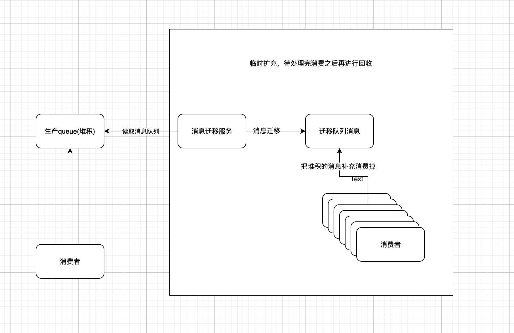

某些场景对于消息的顺序消费还是需要保证的（比如扣款查询，先验证权限，然后再扣款）。还有当消费的速度跟不上堆积的速度，就会造成消息堆积。本篇针对上面两个问题场景简单聊一下。

<!-- more -->

#### 消息顺序消费
- 消息顺序消费其实是业务常见的场景。从生产者生产消息没有按照顺序生产，到消费者没有按照顺序消费，都是会对业务有影响。但是本质上还是消费者拿到消息之后能够保证消费是按照顺序来消费。
##### 如何解决
- 我们先从本质上来看这个问题：消息顺序消费，其实就是在前置消息没有完成，后面的消息就不能够被消费。基本上就是同步的任务执行顺序。
- 我们要解决上面的本质问题有下面几种方案：
	- 把相关的消息做成一个原子消息，任意一个消费者拿到消息都是可以保证按照顺序执行的。
		- 但是这个方案有个限制，需要将相关的消息封装成一个原子消息。有可能消息是不同的服务生产的，所以就无法在生产者将消息直接封装成一个原子消息。这种情况也是可以解决的，在消费者中间增加一个消息拼装的服务，用来专门做消息封装的工作，然后再讲相关的消息发送给消费者。
	- 有些消息可能不能合并成一个原子消息(比如消息太多，无法合并等)，这个时候，我们可以针对这一类型消费指定一个key,每个key我们放置到一个内存queue里面，每个queue单独一个thread,来消费消息即可。

#### 消息堆积
- 产生消息堆积的场景有很多，但本质还是消费跟不上生产的频率。
- 一般不会发生，一旦发生就是大问题！！！(都是泪)
- 实际生产上的一个问题：因为刚开始写消费的时候，没有考虑到并发消费的问题。所以实际消费是1个服务1个消费线程再跑。等待发现问题的时候，线上已经堆积了接近100w的消息了。
##### 如何解决
解决的思路；先修复消费者的问题--->堆积消息迁移->消费迁移之后的堆积消息->恢复原有架构


- 先修复消费者单线程消费-->改成多线程。
- 消息迁移，先将堆积的消息消费掉，扔到其他的队列里面(不影响后续的生产环境的消息)
- 扩容10倍的机器，对迁移之后的数据进行消费。
- 等待所有消费都完成之后，再把扩容的机器，重新下掉。

#### 参考大佬

[如何保证消息的顺序性？](https://doocs.github.io/advanced-java/#/./docs/high-concurrency/how-to-ensure-the-order-of-messages)

[如何解决消息队列的延时以及过期失效问题？消息队列满了以后该怎么处理？有几百万消息持续积压几小时，说说怎么解决？](https://doocs.github.io/advanced-java/#/./docs/high-concurrency/mq-time-delay-and-expired-failure)

