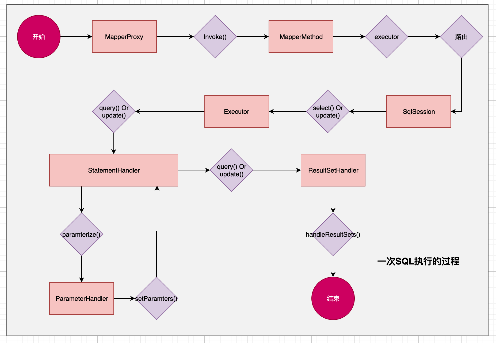
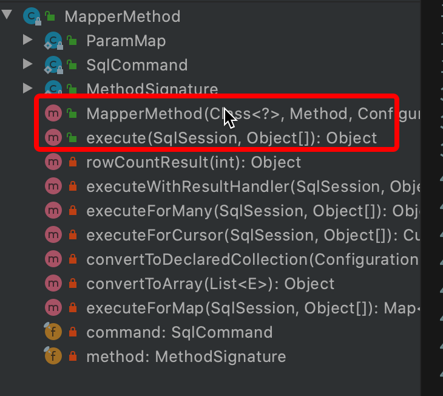

通过本篇文章我们聊一下一次SQL执行的步骤都有哪些

<!-- more -->

#### 总体执行图，本篇文章的核心

<!--  -->



#### 部分核心代码分析

##### demo
```
SqlSession session = sqlSessionFactory.openSession();
try {
    ArticleDao articleDao = session.getMapper(ArticleDao.class);
    Article article = articleDao.findOne(1);

    Author author = article.getAuthor();
    article.setAuthor(null);

    System.out.println("\nauthor info:");
    System.out.println(author);
    System.out.println("\narticles info:");
    System.out.println(article);
} finally {
    session.close();
}
```
##### session.getMapper 获取到MapperProxy
就是上文中的`ArticleDao articleDao = session.getMapper(ArticleDao.class);`
因为Mapper是接口不能直接实例化，所以MapperProxy就是使用JDK动态代理功能，间接实例化Mapper。

##### 使用MapperProxy.invoker方法-> 获取到MapperMethod
demo中的`articleDao.findOne(1);`就是调用mapperProxy.invoker方法
这部分功能就是，从SqlSession->Executor过程
部分源码
```
@Override
  public Object invoke(Object proxy, Method method, Object[] args) throws Throwable {
    try {
      if (Object.class.equals(method.getDeclaringClass())) {
        return method.invoke(this, args);
      } else if (isDefaultMethod(method)) {
        return invokeDefaultMethod(proxy, method, args);
      }
    } catch (Throwable t) {
      throw ExceptionUtil.unwrapThrowable(t);
    }
    final MapperMethod mapperMethod = cachedMapperMethod(method);
    // 实际的执行
    return mapperMethod.execute(sqlSession, args);
  }
	// 缓存MapperMethod对象
  private MapperMethod cachedMapperMethod(Method method) {
    MapperMethod mapperMethod = methodCache.get(method);
    if (mapperMethod == null) {
      mapperMethod = new MapperMethod(mapperInterface, method, sqlSession.getConfiguration());
      methodCache.put(method, mapperMethod);
    }
    return mapperMethod;
  }
```
##### MapperMethod 
MapperMethod 代码结构图
<!--  -->

可以看出来实际上就是只有两个`public`的方法，一个是构造函数，一个就是execute.
所有就是有两个功能
* 解析Mapper接口方法,封装成MapperMethod对象。这里要注意下，有两个类成员 
	* `SqlCommand`,这个类包含了执行的方法是属于那种类型。
	* `MethodSignature` 执行方法的一些属性，返回值的类型(单个，还是批量，还是其他)
* 将`SqlCommand` 路由到SqlSession对应的方法上
###### MapperMethod.execute
根据入参，路由到SqlSession提供的方法中.
```
public Object execute(SqlSession sqlSession, Object[] args) {
    Object result;
    switch (command.getType()) {
      case INSERT: {
      Object param = method.convertArgsToSqlCommandParam(args);
        result = rowCountResult(sqlSession.insert(command.getName(), param));
        break;
      }
      case UPDATE: {
        Object param = method.convertArgsToSqlCommandParam(args);
        result = rowCountResult(sqlSession.update(command.getName(), param));
        break;
      }
      case DELETE: {
        Object param = method.convertArgsToSqlCommandParam(args);
        result = rowCountResult(sqlSession.delete(command.getName(), param));
        break;
      }
      case SELECT:
        if (method.returnsVoid() && method.hasResultHandler()) {
          executeWithResultHandler(sqlSession, args);
          result = null;
        } else if (method.returnsMany()) {
          result = executeForMany(sqlSession, args);
        } else if (method.returnsMap()) {
          result = executeForMap(sqlSession, args);
        } else if (method.returnsCursor()) {
          result = executeForCursor(sqlSession, args);
        } else {
          Object param = method.convertArgsToSqlCommandParam(args);
          result = sqlSession.selectOne(command.getName(), param);
        }
        break;
      case FLUSH:
        result = sqlSession.flushStatements();
        break;
      default:
        throw new BindingException("Unknown execution method for: " + command.getName());
    }
    if (result == null && method.getReturnType().isPrimitive() && !method.returnsVoid()) {
      throw new BindingException("Mapper method '" + command.getName() 
          + " attempted to return null from a method with a primitive return type (" + method.getReturnType() + ").");
    }
    return result;
  }
```
在之后就是SqlSession->Executor->StatementHandler 这条链路了。我会在其他的文章中详解

#### 参考大佬
- [Mybatis3.4.x技术内幕](https://my.oschina.net/zudajun?tab=newest&catalogId=3532897)
