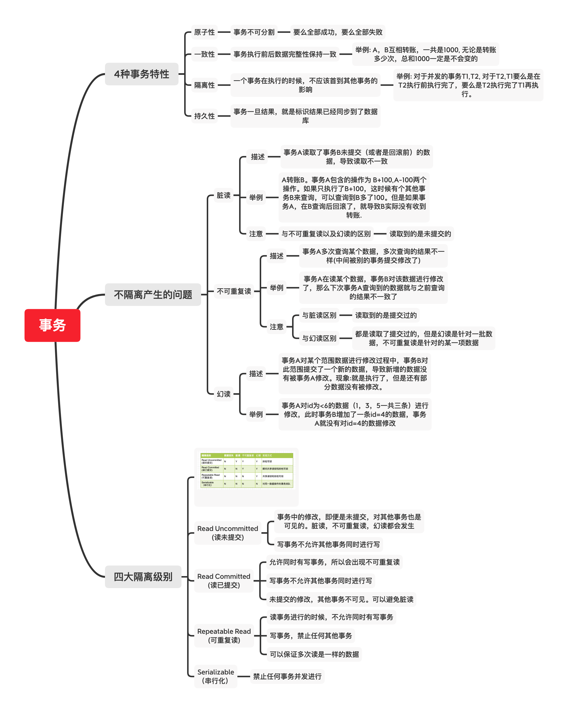
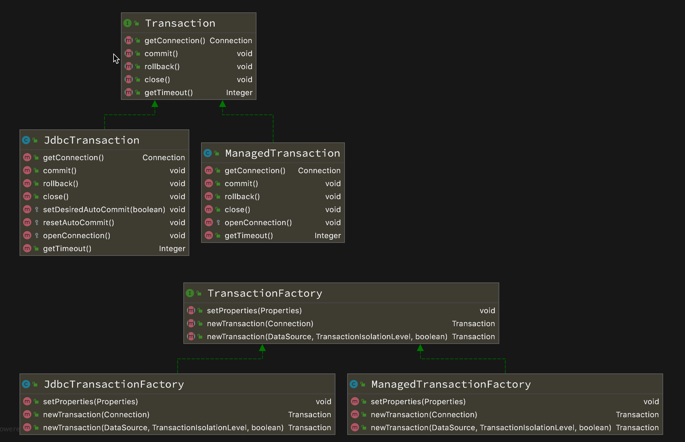
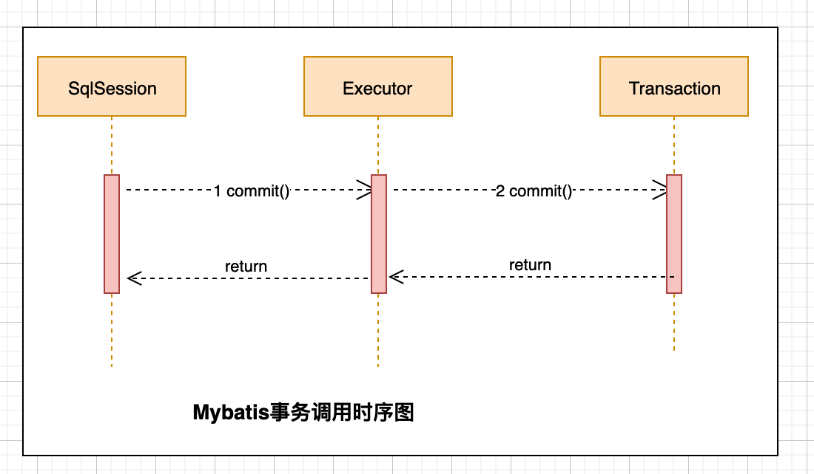

本篇我们来解密下Mybatis的事务管理

<!-- more -->

#### 事务基本概念
<!--  -->


####  Transaction接口
```
public interface Transaction {
    Connection getConnection() throws SQLException;

    void commit() throws SQLException;

    void rollback() throws SQLException;

    void close() throws SQLException;

    Integer getTimeout() throws SQLException;
}
```
核心也就是三个方法
* commit 提交事务
* rollback 回滚事务
* close 关闭一个连接，或者是把conn连接放回连接池中。
##### 类关系图
Mybatis中的Transaction是由工厂类生成的，具体可以在mybatis-config 配置`transactionManager`标签
具体的类关系图见下图:
<!--  -->


##### JdbcTransaction 
单独使用Mybatis时，是默认的实现，其代码就是JDBC事务的极简单封装。
* 需要注意: 对于commit 和rollback 都是直接用的connection的方法，但是JdbcTransaction.close函数，在close之前多了个resetActoCommit(). 如下
	```
	public void close() throws SQLException {
    if (connection != null) {
      resetAutoCommit();
      if (log.isDebugEnabled()) {
        log.debug("Closing JDBC Connection [" + connection + "]");
      }
      connection.close();
    }
  }
	```
	`close()`本身就是就是销毁conn. 但是销毁前，又多做了一步，岂不是多此一举。答案当然不是,close并不是一定是销毁，可能还是会被放回连接池。既然是放回连接池，那么reset下就自然而然就是恢复默认值，也就可以理解为什么会多此一举。
	
##### ManagedTransaction
功能是托管服务，空壳事务管理器，主要是提醒用户，在不通的环境将事务托管为其他的框架。
部分代码
```
@Override
  public void commit() throws SQLException {
    // Does nothing
  }

  @Override
  public void rollback() throws SQLException {
    // Does nothing
  }
  
	@Override
  public void close() throws SQLException {
    if (this.closeConnection && this.connection != null) {
      if (log.isDebugEnabled()) {
        log.debug("Closing JDBC Connection [" + this.connection + "]");
      }
      this.connection.close();
    }
  }
```
#### Transaction使用
先给结论: 
- 无论是SqlSession 还是Executor的事务方法，最终都是指向了Transaction接口的事务方法.
- 无参openSession(),默认是autocommit=false 

调用时序图见下图
<!--  -->


##### 代码分析
###### Transaction 创建
- 在SqlSessionFactory创建SqlSession的时候，会调用TransactionFactory创建Transaction.
  ```
  	@Override
    public SqlSession openSession() {
      return openSessionFromDataSource(configuration.getDefaultExecutorType(), null, false);
    }	
    
    private SqlSession openSessionFromDataSource(ExecutorType execType, TransactionIsolationLevel level, boolean autoCommit) {
    Transaction tx = null;
    try {
      final Environment environment = configuration.getEnvironment();
      // 创建事务
      final TransactionFactory transactionFactory = getTransactionFactoryFromEnvironment(environment);
      tx = transactionFactory.newTransaction(environment.getDataSource(), level, autoCommit);
      // 创建Executor 实际是Exector里面会存在Transaction 成员变量
      final Executor executor = configuration.newExecutor(tx, execType);
      return new DefaultSqlSession(configuration, executor, autoCommit);
    } catch (Exception e) {
      closeTransaction(tx); // may have fetched a connection so lets call close()
      throw ExceptionFactory.wrapException("Error opening session.  Cause: " + e, e);
    } finally {
      ErrorContext.instance().reset();
    }
  }
  ```
###### 调用
SqlSession.commit->Executor.commit->Transaction.commit

- 下面是SqlSession的调用
```
@Override
  public void commit(boolean force) {
    try {
      executor.commit(isCommitOrRollbackRequired(force));
      dirty = false;
    } catch (Exception e) {
      throw ExceptionFactory.wrapException("Error committing transaction.  Cause: " + e, e);
    } finally {
      ErrorContext.instance().reset();
    }
  }
```

- 下面是BaseExecutor调用
```
@Override
  public void commit(boolean required) throws SQLException {
    if (closed) {
      throw new ExecutorException("Cannot commit, transaction is already closed");
    }
    clearLocalCache();
    flushStatements();
    if (required) {
      transaction.commit();
    }
  }
```

#### 注意点
- 一个Conn生命周期中，会有多个事务，但是rollback只能回滚未提交的事务
- autoCommit=false,没有执行close(),会发生什么?
	- 结论: sqlSession关闭的时候，如果是insert/update/delete操作，会rollback()。
	- 源码分析
		```
		// SqlSession.close()
	@Override
  public void close() {
    try {
      executor.close(isCommitOrRollbackRequired(false));
      closeCursors();
      dirty = false;
    } finally {
      ErrorContext.instance().reset();
    }
  }
  private boolean isCommitOrRollbackRequired(boolean force) {
  	// 这里的dirty 在insert/update/delete的时候是true
    return (!autoCommit && dirty) || force;
  }
		```
- autoCommit=false, 不commit 也不close.
	- 如果隔离级别是`Read Uncommitted`,那么在jvm生命周期内，可以读取到。jvm结束后会rollback

#### 总结
Mybatis的事务其实就是JDBC的事务管理，只是扩展了支持连接池的conn. 只要对数据库进行操作(增删改)都是在事务里面的。

#### 参考大佬
- [Mybatis3.4.x技术内幕](https://my.oschina.net/zudajun?tab=newest&catalogId=3532897)