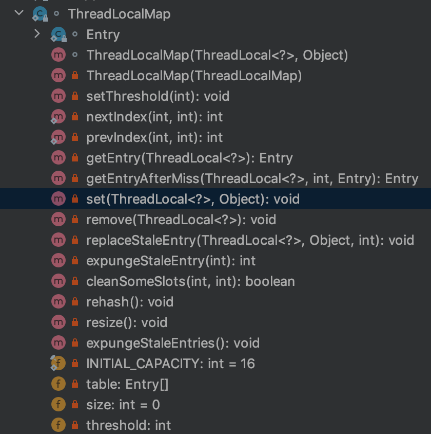

本篇深度剖析下ThreadLocal。主要从下面几个方面:
- 为什么要用ThreadLocal
- ThreadLocal 内部实现原理(原理剖析)
- ThreadLocal为什么会内存溢出可能性.

<!-- more -->

#### 为什么要用ThreadLocal
通常情况下，我们在方法中需要使用方法外的变量，有下面两种方式:
- 命名为静态变量
	- 弊端：会有线程不安全的问题 
- 作为方法传参
	- 弊端，改动比较大

所以SUN公司就提出了ThreadLocal。存储变量的时候, ThreadLocal会获取当前线程，并将需要存储的变量存储关联到Thread.threadLocals（实际类型是ThreadLocalMap） 引用中。获取的时候，ThreadLocal会获取当前线程中的threadLocals, 从其获取对应的数据。这样子就避免了线程安全问题，以及方法传参复杂性过高问题。


##### 适用场景
从上面的解释来看，ThreadLocal的使用场景，就是在方法内使用方法外的变量，并且不希望对整个项目接口改动，就可以使用ThreadLocal.

#### ThreadLocal 内部实现原理

概览: ThreadLocal 实现原理简单讲，就是根据本地的

##### set
```
		public void set(T value) {
        Thread t = Thread.currentThread();
        ThreadLocalMap map = getMap(t);
        if (map != null)
            map.set(this, value);
        else
            createMap(t, value);
    }
    // 获取当前线程中的map连接
		ThreadLocalMap getMap(Thread t) {
        return t.threadLocals;
    }
    // 创建一个新的mapper
		void createMap(Thread t, T firstValue) {
        t.threadLocals = new ThreadLocalMap(this, firstValue);
    }
```

##### ThreadLocalMap
主要功能是，根据传入的Threadlocal对象做key,创建一个Entry对象(其中Entry key为弱引用，value为强引用)，存放到数组中。 

从上面也可以看出`ThreadLoacl 不做实际的存储，是做查找的key`

类方法图




###### set
```
        private void set(ThreadLocal<?> key, Object value) {

            // We don't use a fast path as with get() because it is at
            // least as common to use set() to create new entries as
            // it is to replace existing ones, in which case, a fast
            // path would fail more often than not.

            Entry[] tab = table;
            int len = tab.length;
            // 获取ThreadLocal的唯一标识。注意这个threadLocalHashCode 是new ThreadLocal的时候，就已经创建了。并且是final修饰了
            int i = key.threadLocalHashCode & (len-1);

						// 开放定址法
            for (Entry e = tab[i];
                 e != null;
                 e = tab[i = nextIndex(i, len)]) {
                ThreadLocal<?> k = e.get();

                if (k == key) {
                    e.value = value;
                    return;
                }

                if (k == null) {
                    replaceStaleEntry(key, value, i);
                    return;
                }
            }
						// 没有命中，创建新的
            tab[i] = new Entry(key, value);
            int sz = ++size;
            // 如果没有清楚之前旧的entry, 并且sz大于阈值。扩容重新hash
            // cleanSomeSlots 是清楚key==null 的entry
            if (!cleanSomeSlots(i, sz) && sz >= threshold)
                rehash();
        }
```

######  getEntry
获取entry
```
			private Entry getEntry(ThreadLocal<?> key) {
            int i = key.threadLocalHashCode & (table.length - 1);
            Entry e = table[i];
            if (e != null && e.get() == key)
                return e;
            else
            	// 如果直接查找的找不到，使用开放定址法查找，查找不到返回null
                return getEntryAfterMiss(key, i, e);
        }
```
###### remove 移除一个entry
```
/**
         * Remove the entry for key.
         */
        private void remove(ThreadLocal<?> key) {
            Entry[] tab = table;
            int len = tab.length;
            int i = key.threadLocalHashCode & (len-1);
            for (Entry e = tab[i];
                 e != null;
                 e = tab[i = nextIndex(i, len)]) {
                if (e.get() == key) {
                    e.clear();
                    // 重新hash 重新赋值， 如果是碰到了key==null,那么value也是会变成null的
                    expungeStaleEntry(i);
                    return;
                }
            }
        }
```


#####  get && remove
get其实就是ThreadLocalMap.getEntry的代理。
remove其实就是ThreadLocalMap.remove的代理。

```
    public T get() {
        Thread t = Thread.currentThread();
        ThreadLocalMap map = getMap(t);
        if (map != null) {
            ThreadLocalMap.Entry e = map.getEntry(this);
            if (e != null) {
                @SuppressWarnings("unchecked")
                T result = (T)e.value;
                return result;
            }
        }
        return setInitialValue();
    }
    
    public void remove() {
         ThreadLocalMap m = getMap(Thread.currentThread());
         if (m != null)
             m.remove(this);
     }
```

#### ThreadLocal为什么会内存溢出可能性.
ThreadLocalMap 中的Entry数据结构
```
static class Entry extends WeakReference<ThreadLocal<?>> {
            /** The value associated with this ThreadLocal. */
            Object value;

            Entry(ThreadLocal<?> k, Object v) {
                super(k);
                value = v;
            }
        }
```

注意到Entry的key 是`WeakReference`类型了么，这个是弱引用。

如果线程一直存在，但是Entry中的key为null,但是value是强引用，其实就是会存在某些value一直没有被gc回收，所以就是会存在内存溢出。

##### 解决办法
使用完之后调用下remove即可。 ThreadLocalMap.getEntry和setEntry的都是会调用expungeStaleEntry，expungeStaleEntry如果检测到key==null,也是会将value置为null的


#### 参考大佬
- [别再问我ThreadLocal是什么？一文带你剖析ThreadLocal（真实案例加源码分析）](https://zhuanlan.zhihu.com/p/97738047)
- [为什么需要ThreadLocal模式](https://blog.csdn.net/zhangzeyuaaa/article/details/43564471)
- [ThreadLocal-面试必问深度解析](https://www.jianshu.com/p/98b68c97df9b)


