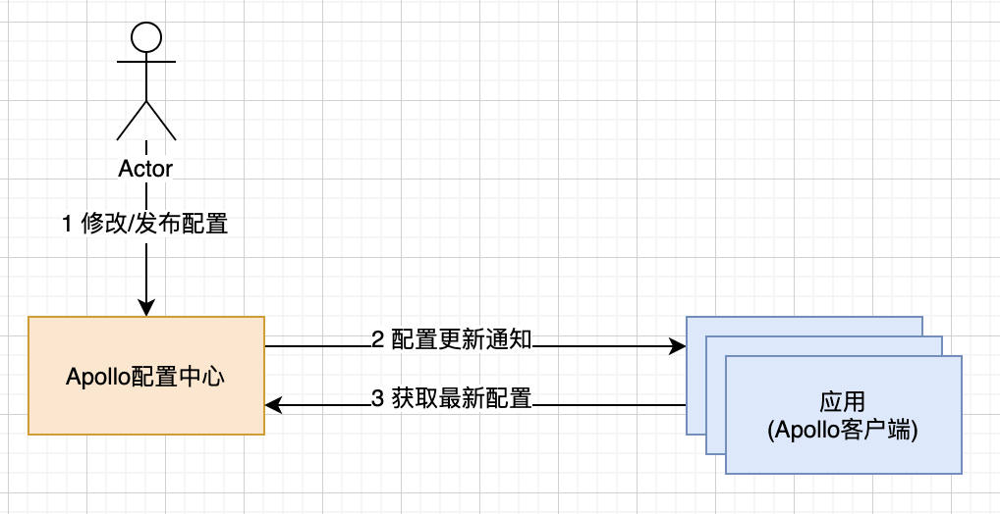
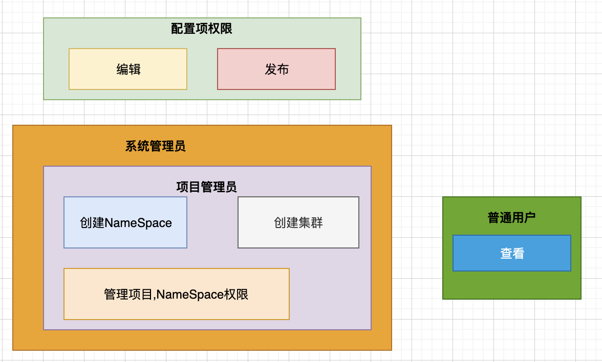
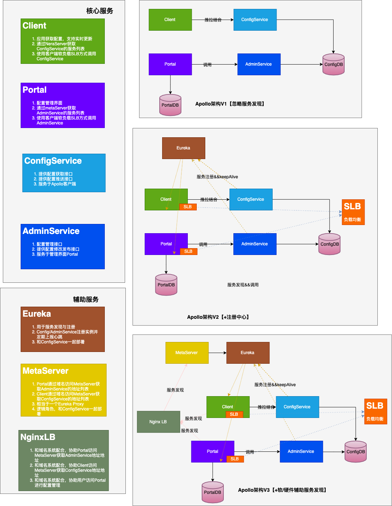

通过本文，你可以了解到Apollo的总体交互流程，整体架构，以及一些核心概念.

<!-- more -->
#### 前言
最近在听杨波老师的微服务课程，对配置中心Apollo十分感兴趣，想深入了解下。所以接下来会逐步通过几篇文章来深入浅出Apollo。本文是第一篇，主要从整体上来感知下。

#### 整体交互模型

<!--  -->

核心分三个部分:
- 用户
- 配置中心
- 客户端

#### 核心概念

##### 应用(application)
- 描述: 标识介入应用的唯一标识，后续更改配置都是基于某个应用层次修改
- 主要场景: 服务隔离
##### 环境(enviorent)
- 描述: 不同环境中，可以配置不同的配置
- 主要场景: 环境隔离
##### 集群(cluster)
- 描述: 一个应用下不同实例的分组, 不同的cluster，可以有不同的配置
- 主要场景:  多数据中心，不同数据中心可以有不同的配置:
##### 名称空间(namespace)
- 描述: 一个应用下的不同配置的分组
- 主要场景: 
	- 不同配置的分组(数据库配置，应用元数据配置)
	- 公共组件之间的配置(public)
	- 应用默认有自己的配置(private)
- 名称空间类型
	- private私有类型: 只能被所属应用获取
	- public共有类型:  多应用共享配置，需全局唯一
		- 部门级别共享配置 
		- 小组级别共享配置
		- ..
	- 关联类型(继承类型) : 私有继承共有会覆盖共有类型(缺省默认), 
		- 默认共有配置
		- 定制中间件配置场景
##### 配置项(Item)
- 描述: 具体配置。KV结构
- Apollo配置唯一标识
	- 私有配置: env+application+cluster+namespace+itemkey
	- 共有配置env+cluster+namespace+itemkey 
##### 权限
  <!--  -->
  
- 描述: 编辑，发布，项目管理
- 角色:
	- 系统管理员: 拥有全部的权限
	- 项目管理员: 可串讲Namespace,cluster,管理项目。
	- 普通用户: 可以查看
- 权限
	- Namespace 编辑，创建
	- Item编辑(不可以发布)，发布(不可编辑)。  

#### 系统架构

<!--  -->


同时食用波波老师的文章(见参考链接)更佳。

注意:
1. 参考地址中波波老师是分5步逐步演进。我是分为了三步。对应主要是基于下游几个点:
	1. V1本质是最原始的配置中心。包含了配置中心Apollo最基本的模块。 对应波波老师演进中的V1
	2. V2本质是解决了V1中Client与服务端服务注册与感知问题。对应波波老师演进中的V2和V3
	3. V3版本本质是解决语言兼容以及其他模块(portal，metaServer等)服务于发现。 对应波波老师演进中的V4和V5

#### 参考大佬
[微服务架构~携程Apollo配置中心架构剖析](https://mp.weixin.qq.com/s/-hUaQPzfsl9Lm3IqQW3VDQ)

